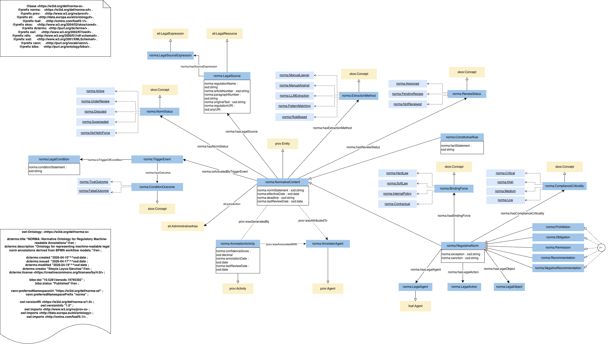

# NORMA Semantic Toolkit

[](https://doi.org/10.5281/zenodo.19765302)
[](https://zenodo.org/communities/norma)
[](https://creativecommons.org/licenses/by-nc/4.0/)
[](https://www.python.org/)
[](#testing)
[](https://www.w3.org/TR/owl2-overview/)
[](https://w3id.org/def/norma-o)

**NORMA** is an open semantic resource for the formal representation and computational processing of legal norms extracted from regulatory documents. It combines an OWL 2 DL ontology, a structured annotation methodology based on BPMN, an automated knowledge-graph construction pipeline, and a SWRL rule generation engine. The result is a self-consistent, queryable, and reasoner ready knowledge graph that faithfully instantiates the ontology from annotated process models.

> Sheyla Leyva-Sánchez · Ontology Engineering Group, Universidad Politécnica de Madrid · CC BY-NC 4.0  
> Ontology DOI: [10.5281/zenodo.19765302](https://doi.org/10.5281/zenodo.19765302) · All resources: [zenodo.org/communities/norma](https://zenodo.org/communities/norma)

---

## Table of Contents

- [NORMA Semantic Toolkit](#norma-semantic-toolkit)
  - [Table of Contents](#table-of-contents)
  - [Overview](#overview)
  - [Motivations and Design Goals](#motivations-and-design-goals)
  - [Repository Structure](#repository-structure)
  - [The NORMA Ontology (TBox)](#the-norma-ontology-tbox)
    - [Statistics](#statistics)
    - [Class Hierarchy](#class-hierarchy)
    - [Controlled Vocabularies (SKOS ConceptSchemes)](#controlled-vocabularies-skos-conceptschemes)
    - [External Alignments](#external-alignments)
  - [Annotation Methodology](#annotation-methodology)
    - [Why BPMN?](#why-bpmn)
    - [Annotation Fields](#annotation-fields)
  - [Knowledge Graph Construction Pipeline](#knowledge-graph-construction-pipeline)
    - [Stage 1 — BPMN Parsing](#stage-1--bpmn-parsing)
    - [Stage 2 — Entity Reconciliation](#stage-2--entity-reconciliation)
    - [Stage 3 — ABox Construction](#stage-3--abox-construction)
    - [Stage 4 — SWRL Rule Extraction](#stage-4--swrl-rule-extraction)
  - [SWRL Rule Generation](#swrl-rule-generation)
  - [SPARQL Interface](#sparql-interface)
  - [Web Application](#web-application)
    - [Key Features](#key-features)
    - [REST API (selected endpoints)](#rest-api-selected-endpoints)
  - [Example — EU AI Act](#example--eu-ai-act)
  - [Alignment with Established Standards](#alignment-with-established-standards)
  - [Constraints and Limitations](#constraints-and-limitations)
  - [Quick Start](#quick-start)
    - [1. Install the core engine](#1-install-the-core-engine)
    - [2. Build the EU AI Act knowledge graph](#2-build-the-eu-ai-act-knowledge-graph)
    - [3. Extract SWRL rules](#3-extract-swrl-rules)
    - [4. Run the web application](#4-run-the-web-application)
  - [Requirements](#requirements)
  - [Testing](#testing)
  - [Contributing](#contributing)
  - [Citation](#citation)
  - [License](#license)

---

## Overview

Regulatory compliance requires understanding which legal obligations, prohibitions, permissions, and recommendations apply to a given agent or system under a specific set of conditions. This determination is non-trivial when norms are scattered across lengthy legal texts and their applicability depends on branching conditions (e.g., whether an AI system is high-risk, whether a controller processes biometric data).

NORMA addresses this by providing:

1. **An OWL 2 DL ontology** (`norma-ontology-v1`) that formally defines the vocabulary of legal norms, their structural components, provenance metadata, and condition-triggering mechanisms.
2. **A Camunda 8 element template** that enables legal experts to annotate BPMN process diagrams with structured normative metadata directly inside a standard process modelling tool.
3. **An automated construction pipeline** (`norma_engine`) that transforms annotated BPMN files into a validated OWL ABox, resolving entity references and enforcing ontological constraints.
4. **A SWRL rule generator** that derives condition-aware inference rules from the gateway logic embedded in the BPMN, enabling norm determination under a reasoner.
5. **A REST API and web application** for interactive exploration, SPARQL querying, norm editing, and artifact download.

The pipeline is end-to-end: from a BPMN file annotated by a legal expert to a downloadable, reasoner-ready OWL knowledge graph in a single command.

```
Annotated BPMN
      │
      ▼
norma_engine (parse → reconcile → build ABox → extract SWRL)
      │
      ├──▶  ABox Turtle   (.abox.ttl)   — OWL named individuals
      ├──▶  SWRL OWL/XML  (.swrl.owl)  — condition-aware inference rules
      └──▶  REST API / Web UI           — SPARQL, graph, norm editor
```

---

## Motivations and Design Goals

The design of NORMA is guided by four principles:

**Ontological fidelity.** Every individual in the ABox is an exact instantiation of a TBox class; every property triple respects the declared domain, range, and cardinality constraints. The pipeline enforces this automatically — ghost properties and domain violations cannot enter the graph.

**Separation of annotation from reasoning.** Structural facts about norms (agent, action, object, source, provenance) are asserted in the ABox. Conditional applicability is captured separately as SWRL rules whose bodies encode gateway truth values and whose heads assert the deontic type of the activated norm. This separation keeps the ABox stable and lets the SWRL layer be regenerated independently.

**Reuse of established vocabularies.** The ontology aligns with ELI (European Legislation Identifier) for legal sources and jurisdiction, PROV-O for annotation provenance, FOAF for agent typing, and SKOS for extensible controlled vocabularies. This maximises interoperability without reinventing existing standards.

**Practical usability.** The annotation interface is a standard Camunda Modeler element template — no RDF tooling is required from the legal expert. The web application allows non-technical users to inspect, query, and export the knowledge graph without writing SPARQL or OWL.

---

## Repository Structure

```
norma-semantic-toolkit/
│
├── norma-ontology/
│   ├── norma-ontology-v1.ttl        # OWL 2 DL ontology (Turtle)
│   └── norma-ontology-v1.rdf        # OWL 2 DL ontology (RDF/XML)
│
├── camunda-template/
│   └── camunda8-compliance-template.json   # Camunda 8 element template
│
├── norma_engine/                    # Core Python package
│   ├── parsing/
│   │   └── bpmn_parser.py           # BPMN → reduced graph (nodes, edges, gateways)
│   ├── kg/
│   │   ├── builder.py               # ABox Turtle generator
│   │   └── normalizer.py            # Entity label reconciliation
│   ├── rules/
│   │   ├── ir.py                    # Intermediate representation (RuleIR, Atom types)
│   │   └── extractor.py             # Path enumeration → SWRL IR
│   ├── exporters/
│   │   ├── swrl.py                  # IR → OWL/XML SWRL export
│   │   └── human_readable.py        # IR → natural-language rule strings
│   └── cli/
│       ├── build.py                 # CLI: build ABox
│       └── rules.py                 # CLI: extract and export SWRL
│
├── regulations/
│   └── eu-ai-act/
│       ├── bpmn/                    # Annotated BPMN files
│       └── entities.json            # Entity reconciliation overrides
│
├── web-app/
│   ├── backend/                     # FastAPI application
│   │   ├── main.py                  # REST API routes
│   │   ├── services/
│   │   │   ├── pipeline.py          # Build, export, and query orchestration
│   │   │   ├── storage.py           # Pack registry and persistence
│   │   │   └── graphdb.py           # Oxigraph store + SPARQL graph builder
│   │   └── sparql_presets.py        # Curated SPARQL query library
│   └── frontend/                    # React + Vite + D3 single-page application
│
└── tests/                           # 64 unit and integration tests
    ├── test_parsing.py
    ├── test_rules.py
    ├── test_kg.py
    ├── test_normalizer.py
    └── test_exporters.py
```

---

## The NORMA Ontology (TBox)

**IRI:** `https://w3id.org/def/norma-o`  
**Version IRI:** `https://w3id.org/def/norma-o/1.0`  
**Documentation:** [https://w3id.org/def/norma-o](https://w3id.org/def/norma-o)  
**Serialisations:** Turtle and RDF/XML (both provided)  
**License:** CC BY-NC 4.0  
**DOI:** 10.5281/zenodo.19765302



### Statistics

| Element | Count |
|---|---|
| Classes | 23 |
| Object properties | 33 |
| Datatype properties | 24 |
| Named individuals (TBox controlled vocabulary) | 23 |

### Class Hierarchy

The ontology is organised around three principal clusters:

**Normative content** — the legal norm itself:
- `NormativeContent` ← `RegulativeNorm` ← `Obligation`, `Prohibition`, `Permission`, `Recommendation`, `NegativeRecommendation`
- `NormativeContent` ← `ConstitutiveRule`

**Legal structure** — the components of a norm:
- `LegalAgent`, `LegalAction`, `LegalObject`, `LegalSource`, `LegalSourceExpression`

**Condition and triggering** — the n-ary relation pattern for conditional norm activation:
- `LegalCondition` →`hasTrigger`→ `TriggerEvent` →`activatesNorm`→ `NormativeContent`
- `TriggerEvent` →`hasOutcome`→ `ConditionOutcome` (`TrueOutcome`, `FalseOutcome`, …)
- A property chain shortcut `triggersNorm = hasTrigger ∘ activatesNorm` supports direct querying.

**Provenance** — aligned with PROV-O:
- `AnnotationActivity` (subclass of `prov:Activity`) →`wasAssociatedWith`→ `AnnotatorAgent`
- `NormativeContent` (subclass of `prov:Entity`) →`wasGeneratedBy`→ `AnnotationActivity`

### Controlled Vocabularies (SKOS ConceptSchemes)

Each enumerated dimension is modelled as a SKOS scheme with declared `owl:NamedIndividual` members, allowing open extension without modifying the ontology:

| Scheme | Members |
|---|---|
| `BindingForce` | `HardLaw`, `SoftLaw`, `InternalPolicy`, `Contractual` |
| `NormStatus` | `Active`, `UnderReview`, `Disputed`, `Superseded`, `NotYetInForce` |
| `ComplianceCriticality` | `Critical`, `High`, `Medium`, `Low` |
| `ExtractionMethod` | `ManualLawyer`, `ManualAnalyst`, `LLMExtraction`, `PatternMatching`, `RuleBased` |
| `ReviewStatus` | `Approved`, `PendingReview`, `NotReviewed` |
| `ConditionOutcome` | `TrueOutcome`, `FalseOutcome` (extensible) |

### External Alignments

| Standard | Usage in NORMA |
|---|---|
| **ELI** (European Legislation Identifier) | `LegalSource ⊑ eli:LegalResource`; `eli:jurisdiction` with `eli:AdministrativeArea` for jurisdiction |
| **PROV-O** | `AnnotationActivity ⊑ prov:Activity`; `NormativeContent ⊑ prov:Entity`; `AnnotatorAgent ⊑ prov:Agent` |
| **FOAF** | `LegalAgent ⊑ foaf:Agent`; subclasses align with `foaf:Person`, `foaf:Organization` |
| **SKOS** | All controlled vocabularies use SKOS `ConceptScheme` / `Concept` structure |
| **BIBO** | `bibo:doi`, `bibo:status` for ontology-level bibliographic metadata |

---

## Annotation Methodology

NORMA uses **BPMN (Business Process Model and Notation)** as the annotation surface. Process diagrams are modelled in [Camunda Modeler 8](https://camunda.com/platform/modeler/) and enriched with normative metadata through a structured element template (Zeebe extension properties).

### Why BPMN?

BPMN is already widely used in compliance and regulatory contexts to represent procedural obligations. Using it as the annotation medium means:
- Legal experts work in a familiar visual environment with explicit control-flow semantics.
- Gateway conditions (exclusive gateways) directly encode the conditional applicability of norms — no additional formalisation step is needed.
- The process graph provides a machine-readable structure from which inference rules can be derived automatically.

### Annotation Fields

Each BPMN task (norm) can carry the following metadata:

| Field | Ontology mapping | Type |
|---|---|---|
| `compliance_deonticType` | `rdf:type` → `norma:Obligation` / `Prohibition` / etc. | Controlled vocab |
| `compliance_deonticId` | `norma:deonticId` | String (auto-generated if blank) |
| `compliance_normStatement` | `norma:normStatement` | Free text |
| `compliance_agent` | `norma:LegalAgent` individual + `norma:hasLegalAgent` | String → IRI |
| `compliance_action` | `norma:LegalAction` individual + `norma:hasLegalAction` | String → IRI |
| `compliance_object` | `norma:LegalObject` individual + `norma:hasLegalObject` | String → IRI |
| `compliance_regulation` | `norma:LegalSource` individual + `norma:hasLegalSource` | String → IRI |
| `compliance_article` | `norma:fromArticle` (norm) + `norma:articleNumber` (source) | String |
| `compliance_bindingForce` | `norma:hasBindingForce` | Controlled vocab |
| `compliance_status` | `norma:hasNormStatus` | Controlled vocab |
| `compliance_riskLevel` | `norma:hasComplianceCriticality` | Controlled vocab |
| `compliance_extractionMethod` | `norma:hasExtractionMethod` | Controlled vocab |
| `compliance_legalReview` | `norma:hasReviewStatus` | Controlled vocab |
| `compliance_jurisdiction` | `eli:jurisdiction` → provisional `eli:AdministrativeArea` | String → IRI |
| `compliance_annotator` | `norma:AnnotatorAgent` individual | String → IRI |
| `compliance_annotationDate` | `norma:annotationDate` | ISO date |
| `compliance_confidence` | `norma:confidenceScore` | Decimal [0, 1] |
| `compliance_originalText` | `norma:originalText` (on source) | Free text |

Gateway elements carry condition metadata (`gw_conditionStatement`) that the pipeline uses to construct `LegalCondition` and `TriggerEvent` individuals and the corresponding SWRL rule bodies.

---

## Knowledge Graph Construction Pipeline

The `norma_engine` package implements a four-stage pipeline:

### Stage 1 — BPMN Parsing

`norma_engine.parsing.bpmn_parser` reads one or more `.bpmn` files, extracts Zeebe extension properties from task and gateway elements, and constructs a reduced graph: a list of annotated nodes, directed edges, and a gateway outgoing-edge index.

### Stage 2 — Entity Reconciliation

`norma_engine.kg.normalizer` detects near-duplicate entity labels across BPMN files (e.g., `"AI provider"` vs `"AI Provider"`) using fuzzy string matching. Canonical labels are selected automatically or via an override file (`entities.json`), ensuring that a single ontological individual is not minted twice under different surface forms. This is critical for multi-file regulation packs where different process diagrams may refer to the same legal agent or action.

### Stage 3 — ABox Construction

`norma_engine.kg.builder` converts reconciled records into a Turtle ABox that:
- Declares all named individuals with correct `rdf:type` assertions.
- Asserts all data and object properties with domain/range compliance.
- Instantiates the n-ary `LegalCondition → TriggerEvent → NormativeContent` pattern for each exclusive gateway and its outgoing branches.
- Creates `AnnotationActivity` individuals linked to each norm, stamping `norma:annotationDate` (from the annotation metadata or the generation date) and `norma:wasAssociatedWithAnnotator` (from the annotator field or the default `NORMAAnnotator` individual).
- Mints provisional `eli:AdministrativeArea` individuals for jurisdiction strings, ready for later alignment to authoritative URIs.

The resulting ABox imports the TBox (`owl:imports <https://w3id.org/def/norma-o>`) and is self-contained.

### Stage 4 — SWRL Rule Extraction

`norma_engine.rules.extractor` enumerates paths through the BPMN graph from source to norm-bearing tasks. For each path, it collects gateway conditions (boolean constraints) and the norms they activate, constructing an intermediate representation (`RuleIR`) that encodes:
- **Body:** one `DatavaluedPropertyAtom` per gateway condition (`conditionPredicate(?x, true/false)`)
- **Head:** one `ClassAtom` asserting the deontic type of the activated norm

`norma_engine.exporters.swrl` serialises the IR to OWL/XML SWRL. The rule file imports the ABox so that individual declarations need not be repeated in the rule head. The head is intentionally compact: only `ClassAtom` assertions for the norm's modality are emitted; all other property triples are already in the ABox.

---

## SWRL Rule Generation

SWRL rules take the following form. Given a BPMN with an exclusive gateway *G* and a downstream obligation *OBL*:

**Body:** `Is_the_system_high_risk(?x, true)`  
**Head:** `Obligation(:OBL_comply_with_high_risk_requirements)`

The condition predicate (`Is_the_system_high_risk`) is declared as a local `owl:DatatypeProperty` in the SWRL file. A SWRL-capable reasoner (e.g., Pellet, Drools with a SWRL bridge) can evaluate the rule against any ABox individual that carries the relevant property value and infer its deontic type.

Human-readable equivalents are also generated:

```
Is_the_AI_system_used_for_biometric_purposes(?x, true)
  ⇒ Obligation(:OBL_Respect_high_risk_obligations)
```

**Note on unconditional norms.** Norms that are not guarded by any gateway are fully asserted in the ABox and are not emitted as SWRL rules. Rules are generated only where conditionality exists.

---

## SPARQL Interface

The web application exposes a SPARQL 1.1 endpoint backed by [Oxigraph](https://github.com/oxigraph/oxigraph). The ABox and TBox are loaded into the same dataset, enabling queries that combine instance-level and schema-level information.

A library of curated preset queries is provided:

| Query | Description |
|---|---|
| All norms | Every norm with binding force, risk level, and article reference |
| Agents per norm | Which agents are bound by each norm |
| Gateway conditions | Legal conditions with their trigger events and activated norms |
| Hard-law obligations | Obligations classified as hard law, grouped by regulation and article |
| Critical-risk norms | Norms marked as critical or high compliance risk |
| Prohibitions | All prohibitions with agent, action, object, and risk level |
| Norms by regulation | All norms grouped by their source regulation |
| Count by type | Summary count of each deontic modality |

---

## Web Application

The web application provides a graphical interface for the full artifact stack. It is built with FastAPI (backend) and React + Vite + D3.js (frontend).

### Key Features

- **Knowledge graph visualisation** — force-directed graph of all ABox individuals and their semantic relationships. Nodes are colour-coded by ontological type. Provenance nodes (`AnnotationActivity`, `AnnotatorAgent`) share a distinct visual identity. `TriggerEvent` reification nodes are collapsed into direct `LegalCondition --when true/false→ Norm` edges for readability.
- **Norm editor** — inline editing of norm metadata (binding force, status, risk level, review status, annotator, annotation date) with immediate ABox regeneration.
- **SWRL viewer** — OWL/XML syntax and human-readable rule display side by side.
- **SPARQL console** — free-form and preset queries against the Oxigraph store.
- **Entity reconciliation panel** — review and resolve near-duplicate entity labels, confirm intentional distinctions, and trigger pack rebuilds.
- **Artifact download** — ABox (Turtle and RDF/XML), SWRL (OWL/XML), and Camunda element template.
- **Multi-pack support** — official regulation packs (folder-backed, rebuilding from BPMN) and user-uploaded BPMN files coexist in the same session.

### REST API (selected endpoints)

| Method | Path | Description |
|---|---|---|
| `GET` | `/api/pack/{pack}/abox` | ABox in Turtle |
| `GET` | `/api/pack/{pack}/swrl` | SWRL in OWL/XML |
| `GET` | `/api/pack/{pack}/rules` | Rules as JSON with human-readable forms |
| `GET` | `/api/pack/{pack}/graph` | Graph nodes and edges as JSON |
| `POST` | `/api/pack/{pack}/rebuild` | Rebuild pack from source BPMN |
| `GET/POST` | `/api/sparql/{pack}` | SPARQL 1.1 query endpoint |
| `GET` | `/api/pack/{pack}/conditions` | All gateway conditions with evaluatable predicates |
| `POST` | `/api/pack/{pack}/evaluate` | Evaluate a condition set and return applicable norms |
| `POST` | `/api/upload` | Upload a new BPMN file as a pack |

---

## Example — EU AI Act

The repository includes an annotated BPMN model for a fragment of the **EU Artificial Intelligence Act** covering the biometric-system obligations (Articles 8–22 and 60–61). This serves as the primary end-to-end example.

From this single BPMN file, the pipeline produces:

- **2 norms**: `OBL_Respect_high_risk_obligations`, `OBL_ADD_testing_obligations`
- **2 gateway conditions**: biometric-purpose check, real-world testing check
- **3 SWRL rules**: one per conditional norm-activation path
- **1 legal source**: `Regulation_EU_AI_Act` (with article references)
- **3 legal individuals**: `Agent_AI_provider`, `Action_comply`, `Object_AI_system`
- **Full provenance triangle**: `AnnotationActivity` → `NORMAAnnotator` → `LegalSource`

The ABox is a valid OWL 2 DL ontology that can be loaded directly into Protégé or any OWL reasoner.

---

## Alignment with Established Standards

| Standard | Role |
|---|---|
| **OWL 2 DL** | Formal knowledge representation; full reasoner compatibility |
| **SWRL** | Conditional norm inference; compatible with Pellet and Drools SWRL bridge |
| **SPARQL 1.1** | Query interface; backed by Oxigraph |
| **BPMN 2.0** | Annotation surface; processed via standard XML parsing |
| **ELI** | Legal source typing and jurisdiction; aligns with European linked-data legal infrastructure |
| **PROV-O** | Annotation provenance; sub-properties of `prov:wasGeneratedBy`, `prov:wasAssociatedWith`, `prov:wasAttributedTo` |
| **FOAF** | Agent classification; `LegalAgent ⊑ foaf:Agent` |
| **SKOS** | Extensible controlled vocabularies; each dimension is an open `ConceptScheme` |
| **Camunda 8 / Zeebe** | Annotation tooling; element template distributable via Camunda marketplace |

---

## Constraints and Limitations

Transparency about the scope and limitations of this resource is important for reuse:

**Single regulation granularity.** The pipeline is designed to operate on a folder of BPMN files representing a single regulation or regulatory domain. Cross-regulation norm interaction and derogation are not modelled; multi-regulation inference would require additional axioms.

**Jurisdiction URIs.** The ontology correctly uses `eli:jurisdiction` with `eli:AdministrativeArea` individuals. When a jurisdiction string is provided in the annotation template but no authoritative URI is available, the pipeline mints a provisional local individual (`rdfs:label`-only). These provisional resources must be aligned to authoritative URIs (EU Vocabularies, Wikidata) as a post-processing step.

**SWRL reasoning scope.** SWRL rules are generated for conditionally applicable norms only. Unconditional norms are fully declared in the ABox and do not need rules. Reasoner compatibility is tested with Pellet; other SWRL-capable reasoners may require adaptation of the OWL/XML serialisation.

**SWRL expressivity.** The rule bodies currently encode boolean condition values (true/false gateway branches). Numeric comparisons, date ranges, and other complex condition types found in real regulations are not yet supported.

**Annotation coverage.** The EU AI Act example covers one process fragment (biometric AI systems). Full regulatory coverage would require annotation of the complete Act, which is an ongoing effort outside the scope of this resource.

**No automated extraction.** NORMA is a structured annotation framework, not an NLP-based extraction system. Legal experts annotate BPMN diagrams manually. This ensures precision and controlled vocabulary compliance but requires domain expertise.

**Reasoner not bundled.** The SWRL rules and ABox are fully standard and can be loaded into any OWL 2 reasoner, but no reasoner is bundled with the web application. The SPARQL interface operates over asserted triples only; inferred triples (e.g., from SWRL execution or OWL property chains) require an external reasoner.

---

## Quick Start

### 1. Install the core engine

```bash
git clone https://github.com/sheyls/norma-semantic-toolkit.git
cd norma-semantic-toolkit
pip install -e .[dev]
```

### 2. Build the EU AI Act knowledge graph

```bash
norma-build regulations/eu-ai-act/bpmn/ \
  --base https://w3id.org/norma-abox/eu-ai-act \
  --ttl eu-ai-act.abox.ttl
```

### 3. Extract SWRL rules

```bash
norma-rules regulations/eu-ai-act/bpmn/ \
  --abox-iri https://w3id.org/norma-abox/eu-ai-act \
  --rules-iri https://w3id.org/norma-abox/eu-ai-act/rules \
  --out eu-ai-act.swrl.owl
```

### 4. Run the web application

```bash
# Backend
pip install -r web-app/backend/requirements.txt
cd web-app && uvicorn backend.main:app --host 0.0.0.0 --port 8000

# Frontend (separate terminal)
cd web-app/frontend && npm install && npm run dev
```

Open `http://localhost:5173` and select the `eu-ai-act` pack.

---

## Requirements

| Component | Version |
|---|---|
| Python | 3.10+ |
| Node.js | 20+ (frontend only) |
| Camunda Modeler | 8.x (annotation only) |

Python dependencies (core engine): `lxml`, `rdflib`, `rapidfuzz`  
Python dependencies (web backend): `fastapi`, `uvicorn`, `pyoxigraph`  
Frontend: `react`, `vite`, `d3`

---

## Testing

The test suite covers parsing, rule extraction, ABox construction, entity normalisation, and SWRL export. All 64 tests pass against the current codebase.

```bash
pip install -e .[dev]
pytest
```

| Module | Tests | Coverage |
|---|---|---|
| `test_parsing.py` | 14 | BPMN parsing and graph construction |
| `test_rules.py` | 21 | Path enumeration, IR construction, condition handling |
| `test_kg.py` | 11 | ABox Turtle output, individual minting, provenance |
| `test_normalizer.py` | 7 | Fuzzy matching, override resolution |
| `test_exporters.py` | 11 | SWRL OWL/XML serialisation, head compactness |

---

## Contributing

Contributions are welcome from two communities:

**Legal experts and annotators**: if you work with regulatory documents, you can contribute by annotating new BPMN process models for regulations not yet covered, reviewing or correcting existing annotations in `regulations/`, improving the controlled vocabulary definitions, or providing feedback on whether the ontology correctly captures legal distinctions in your domain.

**Ontology engineers and researchers**: you can contribute by extending the TBox with new classes or properties, improving alignments with external vocabularies (ELI, PROV-O, SKOS), proposing new SPARQL query presets, filing issues for modelling inconsistencies, or adapting the pipeline for new annotation tools beyond Camunda.

Please open an issue or pull request at [github.com/sheyls/norma-semantic-toolkit](https://github.com/sheyls/norma-semantic-toolkit) to get started.

---

## Citation

If you use the **NORMA Semantic Toolkit** (pipeline, web application, or annotation methodology), please cite:

```bibtex
@software{leyvaSanchez2026normaToolkit,
  title        = {{NORMA} Semantic Toolkit},
  author       = {Leyva-S{\'a}nchez, Sheyla},
  year         = {2026},
  url          = {https://github.com/sheyls/norma-semantic-toolkit},
  note         = {OWL 2 ontology, BPMN annotation methodology, knowledge graph construction pipeline, and SWRL rule generator for legal norm formalisation. CC BY-NC 4.0.}
}
```

If you use the **NORMA-O ontology** specifically, please also cite:

```bibtex
@misc{leyvaSanchez2026norma,
  title        = {{NORMA-O}: The {NORMA} Ontology for Legal Norm Annotations},
  author       = {Leyva-S{\'a}nchez, Sheyla},
  year         = {2026},
  doi          = {10.5281/zenodo.19765302},
  url          = {https://doi.org/10.5281/zenodo.19765302},
  note         = {OWL 2 DL ontology for machine-readable legal norm annotation. CC BY-NC 4.0.}
}
```

---

## License

The ontology, annotation template, pipeline source code, and example artifacts are released under the **Creative Commons Attribution-NonCommercial 4.0 International License (CC BY-NC 4.0)**.

You are free to share and adapt this material for any non-commercial purpose, provided appropriate credit is given to the original authors and the DOI is cited. Commercial use is not permitted without explicit written permission from the authors.

See [LICENSE](LICENSE) for the full text.
